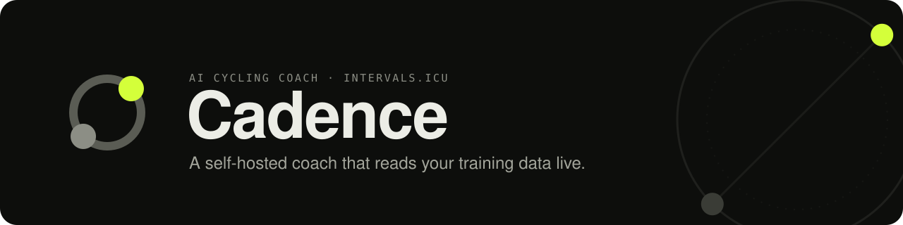

<p align="center">
  
</p>

<h1 align="center">Cadence</h1>

<p align="center">
  <strong>Your own AI cycling coach. It reads your training data, knows your schedule, and runs on your computer.</strong>
</p>

<p align="center">
  <a href="#-get-started-in-10-minutes">Get started</a> ·
  <a href="#-what-it-does">Features</a> ·
  <a href="#-choose-your-ai">Choose your AI</a> ·
  <a href="#-troubleshooting">Troubleshooting</a>
</p>

---

Cadence is a coach you talk to. Ask *"Am I fresh enough for intervals today?"* or *"Plan my next week around a
Saturday group ride"* and it looks up your fitness, fatigue, sleep, HRV and recent rides on
[Intervals.icu](https://intervals.icu), then answers with a plan. It puts sessions on your calendar only after you
approve them.

- **It knows your numbers.** The coach reads your live Intervals.icu data itself, so you don't paste anything in.
- **It follows your rules.** Tell it once which days are for intervals, long rides, the gym and rest, and it plans around them.
- **It's yours.** It runs on your own machine. Your chats and settings stay on your disk, and you pick the AI provider,
  including fully local models that never leave your computer.

## ✨ What it does

| | |
|---|---|
| 💬 **Coaching chat** | Readiness checks, weekly plans, ride analysis and periodisation advice. Answers stream in live, with a status line showing what the coach is reading. |
| 📈 **Form at a glance** | A sidebar with today's form (TSB), a six-week trend, fitness (CTL) and fatigue (ATL), and this week's planned sessions. |
| 🗓️ **Workouts you approve** | When the coach proposes a session, you see a card with its power profile, duration, TSS and IF. Tap **Add** to put it on your Intervals.icu calendar, or **Skip**. |
| 📐 **Your coach rules** | A week grid of interval, long-ride, gym and rest days, plus weekly volume, local terrain (Cadence can suggest it from your recent rides) and temporary constraints like travel or injury. |
| 🗂️ **Chat history** | Conversations are saved, so you can pick one up later, rename it or delete it. Long chats are summarised automatically to keep AI costs down. |
| 🌗 **Light and dark** | A calm "cockpit" interface in light, dark or system mode. Works on phones too. |
| 🔌 **Any AI provider** | Google Gemini, OpenAI, Anthropic Claude, or a free local model through Ollama. You can switch in Settings at any time. |

---

## 🚀 Get started in 10 minutes

No programming experience needed. You'll install one tool, download Cadence, add two keys and start it.
Steps are the same on **macOS, Windows and Linux** unless noted.

### 1. Install Node.js

Cadence runs on [Node.js](https://nodejs.org) version **22 or newer** (24 LTS recommended).

- **macOS / Windows:** download the **LTS** installer from [nodejs.org](https://nodejs.org/en/download) and run it.
- **Linux:** use your package manager or [nvm](https://github.com/nvm-sh/nvm): `nvm install --lts`.

Open a terminal (macOS: *Terminal*; Windows: *PowerShell*) and check that it worked:

```bash
node --version
```

You should see `v22.x` or higher.

### 2. Turn on pnpm

Cadence uses the [pnpm](https://pnpm.io) package manager, which ships with Node.js. Enable it once:

```bash
corepack enable pnpm
```

> On Windows, if this reports a permissions error, open PowerShell with **Run as administrator** and try again.

### 3. Download Cadence

With [Git](https://git-scm.com/downloads):

```bash
git clone <repository-url> cadence
```

```bash
cd cadence
```

No Git? Download the repository as a ZIP, unzip it, and `cd` into the unzipped folder in your terminal.

### 4. Install dependencies

```bash
pnpm install
```

This takes a minute or two the first time.

### 5. Get your keys

You need two things:

**An Intervals.icu API key and athlete ID** (free)

1. Sign in at [intervals.icu](https://intervals.icu) and open **Settings**.
2. Scroll to **Developer Settings**.
3. Copy your **Athlete ID** (it looks like `i123456`), then generate and copy an **API Key**.

**An AI provider key** (pick one; see [Choose your AI](#-choose-your-ai))

The easiest start is a free Google Gemini key from [Google AI Studio](https://aistudio.google.com/apikey).
If you'd rather use no cloud AI at all, skip the key and follow the [Ollama](#run-fully-local-with-ollama) section.

### 6. Add your keys

Make a copy of the example settings file:

```bash
cp .env.example .env.local
```

> On Windows PowerShell, use `copy .env.example .env.local`.

Open `.env.local` in any text editor and fill in your values:

```ini
INTERVALS_ICU_API_KEY=paste_your_intervals_key_here
INTERVALS_ICU_ATHLETE_ID=i123456
GEMINI_API_KEY=paste_your_gemini_key_here
```

Leave the other lines as they are. Prefer not to edit files? You can also enter everything in the app's
**Settings** dialog after it starts.

### 7. Start Cadence

```bash
pnpm build
```

```bash
pnpm start
```

Open **[http://localhost:3000](http://localhost:3000)** in your browser. Try *"How's my form today?"* to check that
everything is connected.

To stop Cadence, press `Ctrl + C` in the terminal. Next time you only need to run `pnpm start` from the Cadence
folder (run `pnpm build` again after updating).

---

## 🤖 Choose your AI

Pick a provider in **Settings** (the gear in the sidebar). Keys can live in `.env.local` on the server or be typed
into Settings, where they're kept in your browser and used only for your requests.

| Provider | Get a key | Default model | Good to know |
|---|---|---|---|
| **Google Gemini** | [AI Studio](https://aistudio.google.com/apikey) | `gemini-3.8-flash` | Free tier available. The default. |
| **OpenAI** | [platform.openai.com](https://platform.openai.com/api-keys) | `gpt-4o` | Any chat model with tool calling. |
| **Anthropic Claude** | [console.anthropic.com](https://console.anthropic.com/settings/keys) | `claude-sonnet-5` | Any Claude model. |
| **Ollama** (local) | No key | `qwen3:1.7b` | Free and private. Coaching quality depends on the model you run. |

You can type any model ID into Settings.

### Run fully local with Ollama

1. Install [Ollama](https://ollama.com/download) and download a model that supports tool calling:

   ```bash
   ollama pull qwen3:1.7b
   ```

   Small models are fine for trying things out. For real coaching, use the largest tool-capable model your
   computer can run comfortably.

2. Ollama's default context window is too small for the coach's instructions. Start it with a bigger one:

   ```bash
   OLLAMA_CONTEXT_LENGTH=16384 ollama serve
   ```

3. In Cadence's **Settings**, choose **Ollama** and your model. If Ollama runs on another machine, set
   `OLLAMA_BASE_URL` in `.env.local` (default `http://localhost:11434/v1`).

---

## 🏠 Running it day to day

**Use it from your phone.** Start Cadence so other devices on your home network can reach it:

```bash
pnpm start -H 0.0.0.0
```

Then open `http://<your-computer's-IP>:3000` on your phone.

> ⚠️ Cadence has **no login** yet. Only expose it on a network you trust, or run it behind Tailscale
> (see [Run it with Docker](#-run-it-with-docker-private-via-tailscale)). Never open it directly to the internet.

**Change the port:** `pnpm start -p 8080`.

**Your data** lives in the `data/` folder: coach rules in `data/athletes/`, chats in `data/chats/`. Back it up
if you care about your history. It's never committed to Git.

**Updating:** pull the latest code (`git pull`), then run `pnpm install`, `pnpm build` and `pnpm start`.

### All settings (`.env.local`)

| Variable | Required | Description |
|---|---|---|
| `INTERVALS_ICU_API_KEY` | yes* | From intervals.icu → Settings → Developer Settings. |
| `INTERVALS_ICU_ATHLETE_ID` | yes* | Your athlete ID, e.g. `i123456`. |
| `GEMINI_API_KEY` | one AI key* | Google AI Studio key. |
| `OPENAI_API_KEY` | one AI key* | OpenAI key. |
| `ANTHROPIC_API_KEY` | one AI key* | Anthropic key. |
| `OLLAMA_BASE_URL` | no | Ollama's OpenAI-compatible endpoint (default `http://localhost:11434/v1`). |
| `OLLAMA_API_KEY` | no | Only for an authenticating proxy in front of Ollama. |

\* Or enter it in the app's Settings dialog instead. Not needed for Ollama.

---

## 🐳 Run it with Docker (private, via Tailscale)

This runs Cadence in Docker on an always-on machine (home server, NAS, VPS or your Mac). You reach it at
`https://cadence.<your-tailnet>.ts.net` from your own devices, wherever you are. No port is opened on the machine,
and anyone who isn't on your Tailscale network can't reach it at all.

1. **Install [Docker](https://docs.docker.com/get-docker/)** on the server, and
   **[Tailscale](https://tailscale.com/download)** on the phone and laptop you'll use Cadence from, all signed in to
   the same Tailscale account.
2. **Turn on HTTPS.** In the [Tailscale admin console → DNS](https://login.tailscale.com/admin/dns), enable
   MagicDNS and HTTPS Certificates.
3. **Create an auth key** in [Settings → Keys](https://login.tailscale.com/admin/settings/keys). A one-off key is
   fine. Put it in a file named `.env` next to `compose.yaml`:

   ```bash
   TS_AUTHKEY=tskey-auth-...
   ```

   It's only used the first time. After that the login is kept in the `tailscale-state` volume, and you can delete
   the line.
4. **Add your keys** to `.env.local` (the same file as [step 6](#6-add-your-keys)), or enter them later in Settings.
5. **Start it:**

   ```bash
   docker compose up -d --build
   ```

6. Open `https://cadence.<your-tailnet>.ts.net`. The first load can take a few seconds while the certificate is
   issued.

In the admin console's **Machines** page, choose **Disable key expiry** for `cadence`. Otherwise the device drops
off your network after 180 days.

**Your data** is in `data/` next to `compose.yaml`, the same folder a plain `pnpm start` uses. The container runs
as user 1000. On Linux, if chats don't save, run `sudo chown -R 1000:1000 data`.

**Updating:** `git pull`, then `docker compose up -d --build`.

**Logs:** `docker compose logs -f cadence`.

**Ollama** on the same machine is reached at `http://host.docker.internal:11434/v1`. On Linux, start Ollama with
`OLLAMA_HOST=0.0.0.0` so the container can reach it. For Ollama on another machine, set `OLLAMA_BASE_URL` in `.env`.

**Only you, even inside your tailnet:** if you share the tailnet with others, add an
[access rule](https://login.tailscale.com/admin/acls) that allows only your user to reach `cadence`.

---

## 🩺 Troubleshooting

| Problem | Fix |
|---|---|
| `pnpm: command not found` | Run `corepack enable pnpm` (step 2), then open a new terminal. |
| `node` is older than v22 | Install the current LTS from [nodejs.org](https://nodejs.org). |
| Sidebar shows no data / "401" errors | Check your Intervals.icu API key and athlete ID in `.env.local` or Settings. |
| "Model not available" | The provider retired that model. Pick a newer one in Settings. |
| The coach ignores instructions or never looks up data on Ollama | Start Ollama with `OLLAMA_CONTEXT_LENGTH=16384` and use a model that supports tools. |
| `Port 3000 is already in use` | Another app is on that port. Use `pnpm start -p 3001`. |
| Page loads without styling or shows `ENOENT` errors | Stop every running Cadence process, delete the `.next` folder, then build and start again. |

---

## 🔒 Privacy

- Cadence runs entirely on your machine. There is no Cadence server, account or tracking.
- Your training data goes from Intervals.icu to your computer, and from there only to the AI provider you chose.
  With Ollama, it doesn't leave your computer at all.
- Keys entered in Settings stay in your browser and are sent only to your own Cadence server.

---

## 🛠️ For developers

Built with **Next.js 15**, **React 19**, **Tailwind CSS** and the **[AI SDK](https://ai-sdk.dev) v7**, so the coach
isn't tied to one LLM provider.

```bash
pnpm dev                 # dev server with hot reload on http://localhost:3000
pnpm exec tsc --noEmit   # typecheck
pnpm build               # production build
```

```
app/api/chat         → resolves provider/model, builds the coach prompt, streams the reply with Intervals tools
app/api/chats        → saved chat history: list, load, rename, delete
app/api/metrics      → sidebar data: form, six-week history, this week's planned sessions
app/api/preferences  → coach rules per athlete
lib/intervals/       → typed Intervals.icu client, AI tools, response compaction, workout parsing
lib/coach/prompt.ts  → coaching methodology + the athlete's rules → system prompt
lib/chat/            → token economy (rolling summary, pruning) and workout approvals
lib/llm/models.ts    → provider IDs and default models
lib/storage/         → JSON-file stores for chats and coach rules under data/
components/          → sidebar, chat UI, workout cards, settings and coach-rules dialogs
```

The repo is set up for agentic development: [`CLAUDE.md`](CLAUDE.md) documents the architecture, conventions and
AI SDK v7 pitfalls, and `.claude/` holds two project skills, `verify` and `add-intervals-tool`.

### Design

A calm, cockpit-style interface: warm near-black (or paper-light) surfaces, one lime signal colour for what matters
now and orange for warnings. IBM Plex Sans for text, JetBrains Mono for data, Barlow Condensed for big figures. The
logo is a chainring with a lit lead pedal that turns at 90 rpm whenever the coach is working.

## 🗺️ Roadmap

- More OpenAI-compatible providers (LM Studio, OpenRouter)
- More Intervals.icu tools (power curves, activity intervals, wellness updates)
- Optional login
