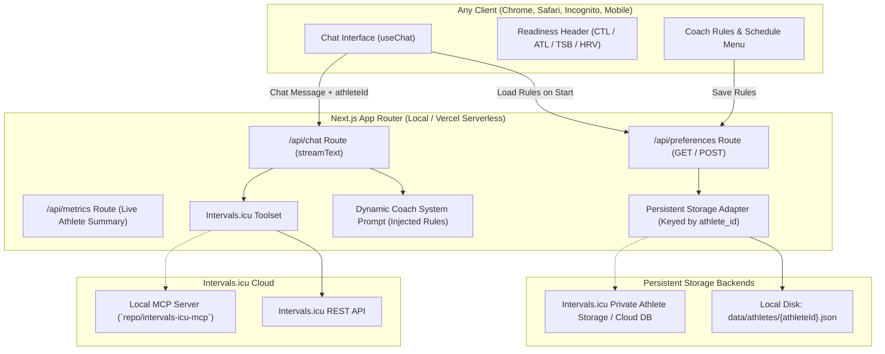

# Implementation Plan: Cycling Coach Web App with Athlete-Keyed Persistent Storage

Build a modern, browser-based Cycling Coach web application in `/Users/nojeda/repo/cycling-coach-app` that runs locally and is ready for 1-click deployment on Vercel. The app allows the athlete to chat with an AI cycling coach with live access to their Intervals.icu training data, fatigue metrics, and calendar—with training rules and schedule preferences **persistently stored and keyed by the Intervals.icu Athlete ID** across all browsers, incognito sessions, and cloud deployments.

---

## Goal Description

Transition from the Antigravity CLI coding assistant skill to a dedicated, browser-accessible cycling coach web app. The application will:
1. Run locally on macOS (`pnpm dev` at `http://localhost:3000`) and be architected for deployment on Vercel.
2. Provide a chat interface where the athlete can converse with an expert cycling coach.
3. Feature an interactive **Coaching Preferences Menu** where the athlete can adjust preferred days for long rides, intervals, rest days, gym sessions, target weekly hours, and custom constraints.
4. **Persistent Storage Keyed by Athlete ID**: Completely avoid browser `localStorage` for coaching rules and preferences. Preferences will be stored server-side keyed by the athlete's Intervals.icu Athlete ID (`i435091`), available across any browser, incognito sessions, and cloud instances.
5. Equip the coach with tools to query Intervals.icu (wellness, fitness CTL/ATL/TSB, recent activities, intervals, and calendar events) using both **direct TypeScript API tools** (Vercel-native) and a **local MCP bridge** connected to the existing `repo/intervals-icu-mcp` Python FastMCP server.
6. Default to Google Gemini (via `@ai-sdk/google`) while supporting OpenAI and Anthropic through in-app settings.

---

## User Review Required

> [!IMPORTANT]
> **Server-Side Athlete-Keyed Persistence (No localStorage dependency)**:
> - **API Endpoints**: `GET /api/preferences?athleteId=...` and `POST /api/preferences`
> - **Local Storage Engine**: Saved in server-side JSON storage at `data/athletes/{athleteId}.json` on your machine. Any browser (Safari, Chrome, Firefox, Incognito, or mobile on local Wi-Fi) connecting to the app immediately accesses the athlete's shared preferences.
> - **Vercel / Cloud Ready**: Supports a pluggable storage interface (`PreferencesStore`). In addition to local file storage, it includes adapters for:
>   - **Intervals.icu Cloud Storage**: Can sync preferences directly into an Intervals.icu private athlete record/folder so no external database is needed even on Vercel!
>   - **Serverless DB**: Optional support for Upstash / Vercel KV / Supabase via `DATABASE_URL` or `KV_REST_API_URL`.

> [!NOTE]
> **Dual Integration Strategy**:
> - **Direct API Tools (Default for Vercel & Fast Local)**: Direct REST calls to `https://intervals.icu/api/v1` via Basic Auth. Zero external process dependencies; works seamlessly on Vercel serverless.
> - **Local MCP Client Bridge**: Optional toggle using `@modelcontextprotocol/sdk` to spawn and communicate via stdio with the Python MCP server in `/Users/nojeda/repo/intervals-icu-mcp`.

---

## Architecture & Data Flow



---

## Proposed Changes

### Project Initialization & Configuration

Location: `/Users/nojeda/repo/cycling-coach-app`

#### [NEW] `package.json`
- Dependencies: `next@15`, `react@19`, `react-dom@19`, `ai`, `@ai-sdk/google`, `@ai-sdk/openai`, `@ai-sdk/anthropic`, `@modelcontextprotocol/sdk`, `zod`, `lucide-react`, `clsx`, `tailwind-merge`, `react-markdown`, `remark-gfm`.
- Scripts: `dev`, `build`, `start`, `lint`.

#### [NEW] `tsconfig.json` & `next.config.ts`
- Standard Next.js TypeScript configuration with path aliases (`@/*`).

#### [NEW] `tailwind.config.ts` & `app/globals.css`
- Athletic performance styling: dark slate background, emerald/cyan accents for power and fitness indicators.

#### [NEW] `.env.example` & `.env.local`
- Local configuration preloaded with:
  - `INTERVALS_ICU_API_KEY=<your_api_key>`
  - `INTERVALS_ICU_ATHLETE_ID=i435091`
  - `GEMINI_API_KEY=`

---

### Athlete-Keyed Persistent Storage Layer

#### [NEW] `lib/types/preferences.ts`
Schema and TypeScript interface for athlete schedule preferences and defaults:
```typescript
export interface CoachPreferences {
  athleteId: string;
  weeklyVolumeMinHours: number; // e.g. 8
  weeklyVolumeMaxHours: number; // e.g. 14
  longRideDays: string[];       // e.g. ["Saturday"]
  intervalDays: string[];       // e.g. ["Tuesday", "Thursday"]
  restDays: string[];           // e.g. ["Monday", "Friday"]
  gymDays: string[];            // e.g. ["Tuesday", "Thursday"]
  sundayRoutine: "rest" | "coffee_ride" | "flexible";
  shortNamingConvention: boolean;
  mountainTerrainNotes: string; // e.g. "+2,000m climbing, Gran Canaria terrain"
  customNotes: string;
  updatedAt: string;
}

export const createDefaultPreferences = (athleteId: string): CoachPreferences => ({
  athleteId,
  weeklyVolumeMinHours: 8,
  weeklyVolumeMaxHours: 14,
  longRideDays: ["Saturday"],
  intervalDays: ["Tuesday", "Thursday"],
  restDays: ["Monday", "Friday"],
  gymDays: ["Tuesday", "Thursday"],
  sundayRoutine: "coffee_ride",
  shortNamingConvention: true,
  mountainTerrainNotes: "Long Saturday rides with high elevation gain (+2,000m, +100km, Gran Canaria altitude)",
  customNotes: "",
  updatedAt: new Date().toISOString(),
});
```

#### [NEW] `lib/storage/preferences-store.ts`
Server-side persistent storage manager:
- `getPreferences(athleteId: string): Promise<CoachPreferences>`
- `savePreferences(preferences: CoachPreferences): Promise<void>`
- **Storage Strategy**:
  1. Checks for local directory `data/athletes/{athleteId}.json` on disk (zero config, permanent locally).
  2. If running on Vercel without local disk, syncs with Intervals.icu or cloud storage.
  3. If no record exists yet, returns default preferences created for that `athleteId` and saves them.

#### [NEW] `app/api/preferences/route.ts`
REST route for fetching and updating preferences:
- `GET /api/preferences?athleteId=...`: returns the saved preferences for the athlete.
- `POST /api/preferences`: validates payload and persists changes to disk/cloud store.

---

### Backend: Intervals.icu & AI Integration

#### [NEW] `lib/intervals/client.ts`
Direct, typed HTTP client for Intervals.icu REST API:
- `getAthleteProfile(athleteId?: string)`
- `getFitnessSummary(athleteId?: string)`
- `getWellnessData(athleteId?: string, oldest?: string, newest?: string)`
- `getRecentActivities(athleteId?: string, limit?: number, oldest?: string, newest?: string)`
- `getActivityDetails(activityId: string)`
- `getActivityIntervals(activityId: string)`
- `getCalendarEvents(athleteId?: string, oldest?: string, newest?: string)`
- `createCalendarEvent(athleteId: string, event: Record<string, unknown>)`

#### [NEW] `lib/intervals/tools.ts`
Vercel AI SDK compatible tool definitions with `zod` schemas:
- `icu_get_fitness_summary`: fetches live CTL, ATL, TSB, ramp rate.
- `icu_get_wellness_data`: fetches recent resting HR, HRV, sleep, soreness, fatigue.
- `icu_get_recent_activities`: lists recent workouts, distances, TSS, normalized power.
- `icu_get_activity_details`: inspects interval splits, power metrics, heart rate zones.
- `icu_get_calendar_events`: reads planned training schedule.
- `icu_create_calendar_event`: schedules workouts directly onto Intervals.icu.

#### [NEW] `lib/mcp/bridge.ts`
- Bridge using `@modelcontextprotocol/sdk` to connect to the local Python MCP server (`/Users/nojeda/repo/intervals-icu-mcp`) when local MCP mode is activated.

#### [NEW] `lib/coach/prompt.ts`
- Builds dynamic system prompt by merging the core coaching principles with the athlete's **persistent preferences** loaded for their `athleteId`:
  - Gran Canaria Saturday mountain endurance (+2,000m, +100km).
  - Intervals days spaced with rest/recovery.
  - Gym sessions on configured days.
  - Session naming rules (`OU`, `VO2`, `Coffee Ride`, etc.).
  - Readiness thresholds (TSB > -20 vs TSB < -30).

#### [NEW] `app/api/chat/route.ts`
- Streaming chat route using Vercel AI SDK `streamText`.
- Retrieves the athlete's persistent preferences from `PreferencesStore` using `athleteId`.
- Injects dynamic prompt and executes tool calls against Intervals.icu.
- Returns streaming text + tool call status.

#### [NEW] `app/api/metrics/route.ts`
- Returns athlete readiness summary (CTL, ATL, TSB, HRV, resting HR) to power the top dashboard banner.

---

### Frontend: User Interface & Chat Experience

#### [NEW] `components/Header.tsx`
- App branding: **Apex Cycling Coach**.
- Live readiness badges: Fitness (CTL), Fatigue (ATL), Form (TSB with color-coded status badge: Fresh / Optimal / High Fatigue / Overreached), Resting HR, and HRV.
- Action buttons:
  - ⚙️ **Coach Rules** (opens Schedule Preferences Menu)
  - 🔑 **AI & API Settings** (opens API Keys & Model selection)
  - 📅 **Intervals.icu** (direct link to athlete calendar)

#### [NEW] `components/preferences/CoachPreferencesModal.tsx`
Interactive preferences drawer/modal:
- On open: fetches latest preferences from `/api/preferences?athleteId=...`.
- Adjust:
  - Weekly volume range (hours)
  - Long ride days
  - Interval days
  - Gym days
  - Rest days
  - Sunday routine (Coffee Ride vs Rest Day)
  - Mountain terrain notes & custom notes
- Save: calls `POST /api/preferences`, persisting changes to the server/athlete ID.

#### [NEW] `components/chat/ChatInterface.tsx`
- Streaming conversation interface utilizing `useChat`.
- Expandable tool execution pills (e.g., `⚡ Called icu_get_fitness_summary`, showing live inspection of arguments & results).
- Render rich markdown responses with formatted tables for weekly schedules and interval power targets.

#### [NEW] `components/chat/QuickPrompts.tsx`
- Instant coaching action chips:
  - 📊 *"Assess my current fitness & fatigue (CTL/ATL/TSB)"*
  - 🚴 *"Plan my upcoming training week using my schedule rules"*
  - 🔍 *"Analyze my recent weekend ride"*
  - 💤 *"Check my recovery & HRV readiness"*

#### [NEW] `components/SettingsModal.tsx`
- Select default AI model: Google Gemini 2.0 Flash (Recommended), Gemini 1.5 Pro, OpenAI GPT-4o, Anthropic Claude 3.5 Sonnet.
- Input fields for user API keys.
- Mode selector: Direct API (Recommended & Vercel Ready) vs Local Python MCP Bridge.

#### [NEW] `app/page.tsx` & `app/layout.tsx`
- Responsive layout with dark mode cycling aesthetic.

---

## Verification Plan

### Automated Tests
1. **Type & Lint Check**:
   ```bash
   pnpm run lint
   pnpm exec tsc --noEmit
   ```
2. **Build Verification**:
   ```bash
   pnpm run build
   ```
   Ensure Next.js compiles all routes and static/serverless targets without errors.

### Manual Verification
1. **Dev Server Run**:
   - Start the app with `pnpm dev` on port 3000.
   - Open browser at `http://localhost:3000`.
2. **Persistence Across Browsers & Incognito**:
   - Open Chrome normal window, modify preferred interval days in Coach Rules, and click Save.
   - Open an **Incognito window** or Safari to `http://localhost:3000`.
   - Open Coach Rules and verify the saved changes appear immediately.
   - Inspect `data/athletes/i435091.json` on disk to verify the JSON record is updated.
3. **Live Chat & Tool Execution**:
   - Click quick prompt: *"Assess my current fitness & fatigue"*.
   - Verify the assistant calls `icu_get_fitness_summary` / `icu_get_wellness_data`.
   - Verify the assistant streams a coaching analysis formatted with recommendations based on actual Intervals.icu data.
4. **Workout Planning with Active Preferences**:
   - Ask: *"Plan my workouts for this week"*.
   - Confirm the coach adheres to the schedule saved on the server for `i435091`.
